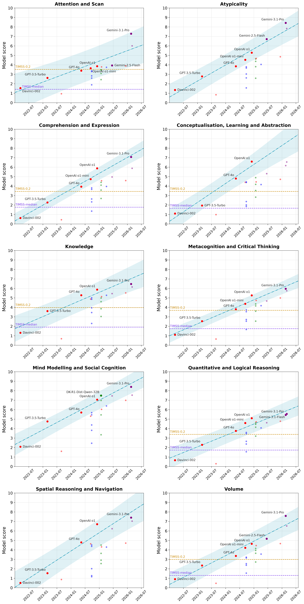
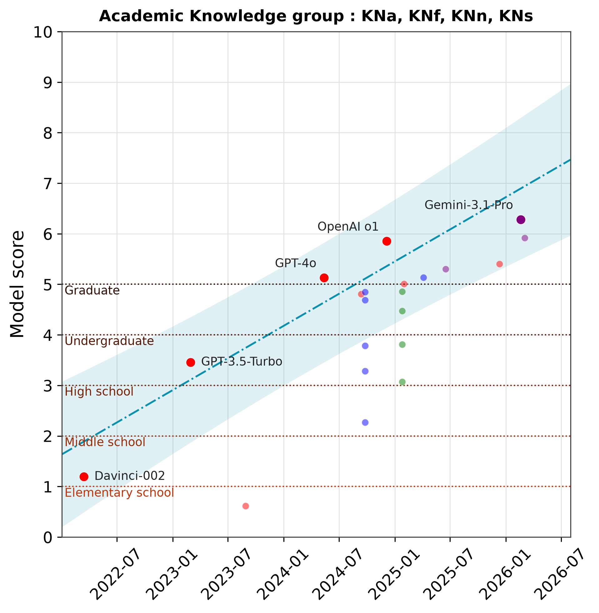

# ADeLe Extension

Code and data behind the post [Tracking AI progress across 18 cognitive dimensions drawn from psychometrics](https://gpaipolicylab.org/blog-4) (GPAI Policy Lab, August 2026).

The **ADeLe** paper ([Zhou et al., *Nature*](https://www.nature.com/articles/s41586-026-10303-2)) annotates 16,108 questions, drawn from 63 tasks across 20 benchmarks, along 18 cognitive dimensions, each on a difficulty scale from 0 to 5+. Once a subject, AI or human, has been evaluated on those questions, the same scales yield an ability profile. The scales are explainable, population-independent and non-saturating, since they describe item difficulty rather than success rate.

This repository cross-references the published profiles of 21 models with their release dates, isolates the capability frontier for each dimension group, and fits a trend on it. Human references come from 183 annotated TIMSS Grade 8 questions, asked worldwide to 13-to-14-year-old students, which anchor the levels in something interpretable:

  

On the knowledge dimensions tied to an academic curriculum, tiers 1 to 5 correspond to elementary school, middle school, high school, undergraduate studies and graduate education:



```
.
├── Trends.ipynb        # Capability trends over time; figures 2 to 5 of the post, in English or French
├── Radar_plots.ipynb   # Ability profiles as radar plots, one panel per model family; figure 1
├── data/
│   ├── ability_profiles_MaxAuxDiff=0_DupThresh=100.csv               # 15 Nature models × 18 dimensions
│   ├── additional_results_16June2026.csv                             # Same, 6 recent models
│   ├── release_dates.csv                                             # 21 dates, with source and GPAI PL status
│   └── adele_profiles_TIMSS_G8_MaxAuxDiff=0_W=information_rho=1.csv  # TIMSS virtual subjects, 183 items
├── figures/            # Written by the notebooks: 300 dpi PNG and vector PDF
└── requirements.txt
```

The profiles are extracted from the ADeLe repository; the 6 recent models are Gemini 2.5 and 3.1, LLaMA 4, GPT-5.2-Chat and o3-mini. The radar plotting functions are inherited from the ADeLe team's notebook, credited in place in the cell that defines them. Both notebooks are independent and read `data/` relative to the repository root, so run Jupyter from there:

```bash
pip install -r requirements.txt
jupyter lab
```

## Method

The 18 dimensions are combined into 10 groups, reusing the groupings proposed by the ADeLe authors, a group's score being the harmonic mean of the dimensions it is made of. Grouping is necessary so that the computation of human baselines does not suffer from too much missing data. Membership is read off the dimension codes, whose first two letters name the parent group; `SN` is the only single-dimension group (`SNs`) and is handled separately.

For each group, the frontier gathers the models whose score is greater than or equal to that of all documented models released on the same date or earlier. A Bayesian affine regression is fitted on that frontier, implemented as a Gaussian process with a linear kernel (`DotProduct`) plus white noise; plots show the posterior mean and the 95% credible interval.

Human references are virtual subjects. TIMSS-*p* solves, by construction, every one of the 183 annotated questions whose international average success rate is greater than or equal to *p*, and fails the others, which gives it a set of answers from which an ADeLe profile is computed exactly as for a model. Varying *p* represents fictional students of different levels: `TIMSS-median` is roughly a median student, `TIMSS-0.2` roughly a top-20% student. Two groups could not be processed for lack of data and a third was judged too fragile, so the baselines are drawn on 7 of the 10 groups.

Scores stay on the raw ADeLe scale. The follow-up [Human Scales preprint](https://arxiv.org/abs/2602.18911) extrapolates these levels to the worldwide population; that extrapolation still seems too fragile, so nothing here relies on it, and only the raw data its authors collected is used.

## Figures

In `Trends.ipynb`, cells 11, 13, 15 and 16 produce figures 2 to 5 of the post. `Radar_plots.ipynb` produces figure 1. Each figure is both shown inline and written to `figures/`.

Cell 2 of `Trends.ipynb` sets the language of the figure text, and the suffix of the exported filenames:

```python
language = 'en'   # 'en' (default) or 'fr'
```

## AI assistance

The data handling and the computations were written by hand, while the figure rendering code comes largely from Claude with manual adjustments.

## Resources

- *Nature* paper: https://www.nature.com/articles/s41586-026-10303-2
- Human Scales preprint: https://arxiv.org/abs/2602.18911 ([ICLR reviews](https://openreview.net/forum?id=3QmrFOiPCy))
- ADeLe code, source of the profiles and of the radar functions: https://github.com/Kinds-of-Intelligence-CFI/ADeLe-AIEvaluation
- Additional models: https://kinds-of-intelligence-cfi.github.io/ADELE/experiments.html

We thank Peter Romero for sharing the human baseline data, which allowed us to carry out our own analysis without taking on the hypotheses and results of the paper it comes from.
